# Montreal BIXI Real-Time Monitoring Platform

A full-stack data engineering project designed to track, archive, and visualize the status of Montreal's BIXI bike-share network in real-time. Built during the November 2025 STM Strike!

##  Architecture

```mermaid
graph LR
    A["BIXI API – GBFS"] -->|JSON| B["AWS Lambda"]
    B -->|Docker Image| C["AWS ECR"]
    B -->|Write Processed Data| D["AWS RDS PostgreSQL"]
    D -->|SQL Queries| E["Streamlit Dashboard"]
```

### Data Flow

1. ETL: A Python script packaged in a Docker container runs on AWS Lambda every 5 minutes. It fetches live data from the BIXI GBFS feed, transforms it using Polars (go Rust!) and calculates aggregates.
2. Storage: Data is persisted in a PostgreSQL database hosted on AWS RDS. The schema is normalized into `station_status_log` and `system_aggregate_log` ("micro and macro trends" is the idea for the separation).
3. Visualization: A simple Streamlit dashboard, queries the database at regular intervals to render maps, charts, and metrics (uses a 5 mins cache for performance).

### Schema Design

approx. 1,000 insertions every 5 minutes.

* `station_status_log`: Stores raw station states (lat, lon, capacity, bikes_available).
* `system_aggregate_log`: Stores computed metrics per time-step to reduce load on the dashboard side.

### Gallery

